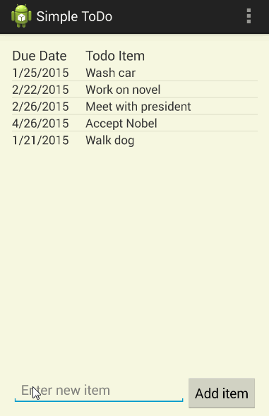

# ToDo
Simple ToDo app

This is an Android demo application of a to-do list.

Time spent: 10 hours spent in total

Completed user stories:

 * [x] Required: Successfully add and remove items
 * [x] Required: Editing todo items
 * [x] Required: Persist the todo items to text file
 * [x] Suggested: Persist the todo items into SQLite instead of a text file
 * [x] Suggested: Improve style of the todo items in the list using a custom adapter
 * [x] Suggested: Tweak the style improving the UI / UX, play with colors
 * [x] Suggested: Add support for completion due dates for todo items (and display within listview item)
 * [x] Suggested: Use a DialogFragment instead of new Activity for editing items

Walkthrough of all user stories:

GIF created with [LiceCap](http://www.cockos.com/licecap/).

